# job4j_cinema

## О проекте

**Приложение _"Кинотеатр"_.**

На главном экране приложения представлены фильмы и их сетка сеанса
в кинотеатре. Предоставляется возможность просмотреть краткую аннотацию 
фильма. Здесь же пользователи могут зарегистрировать или, если уже есть 
учетная запись, зайти в нее. Учетная запись _**необходима**_ для покупки фильма.
Просмотреть афишу фильмов, времени сеанса и доступные места на сеанс, 
можно без регистрации.

После выбора пользователем понравившегося фильма и времени сеанса, 
открывается окно с выбором места на данный фильм. 
_**Уже выкупленные места недоступны для покупки.**_ 

Как только пользователь выбрал понравившееся место, открывается окно 
подтверждения выбора, только если пользователь уже был зарегистрирован. В
противном случае он перебрасывается на окно регистрации, пройдя которую он уже
может продолжить выбор фильмов. 

_Контакты для связи:_
__**burlakovid@inbox.ru**__

Для запуска необходимо:
1. [x] Java 17;
2. [x] Maven 3.8.
3. [x] PostgreSql 14.

Стек используемых технологий:
1. Java 17;
2. PostgreSQL JDBC 42.5.0;
3. Spring boot 2.7.3;
4. Thymeleaf 3.0.15;
5. Bootstrap v5.2.2;
6. liquibase 4.15.0;
8. Lombok 1.18.22.

Перед запуском проекта необходимо создать **БД cinema** и указать 
**_login/password_** в файле _src/main/resources/db.properties_;

Запуск приложения:
```
mvn spring-boot:run
```

Интерфейс:

Главное окно:

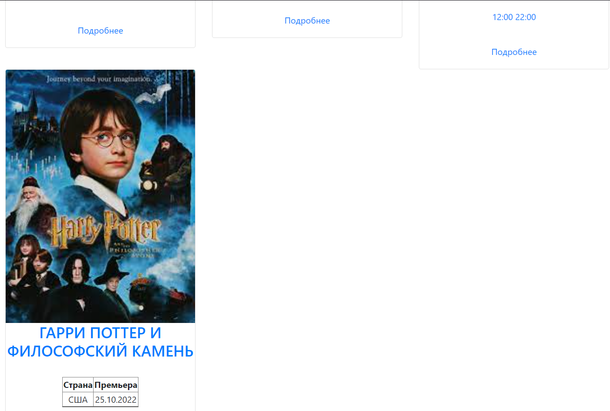

О фильме:
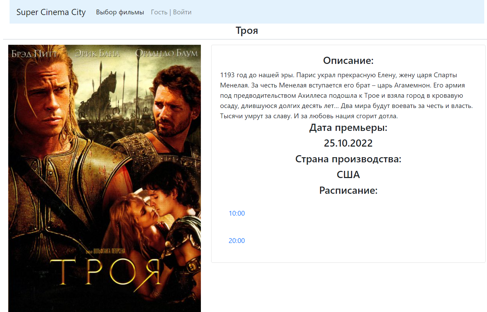

Выбор места:
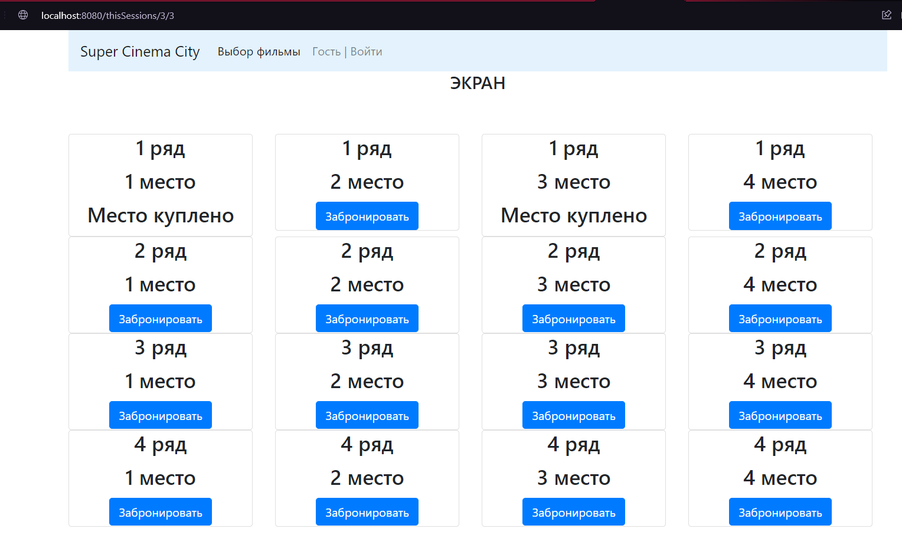

Авторизация при покупке:
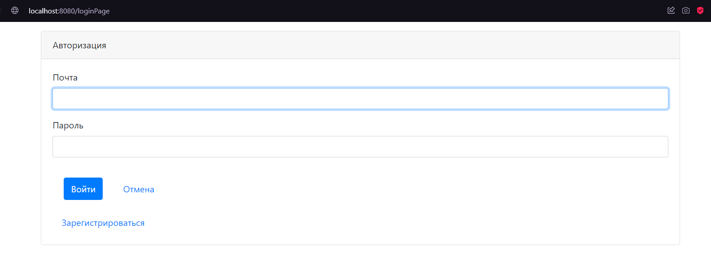

Подтверждение покупки:
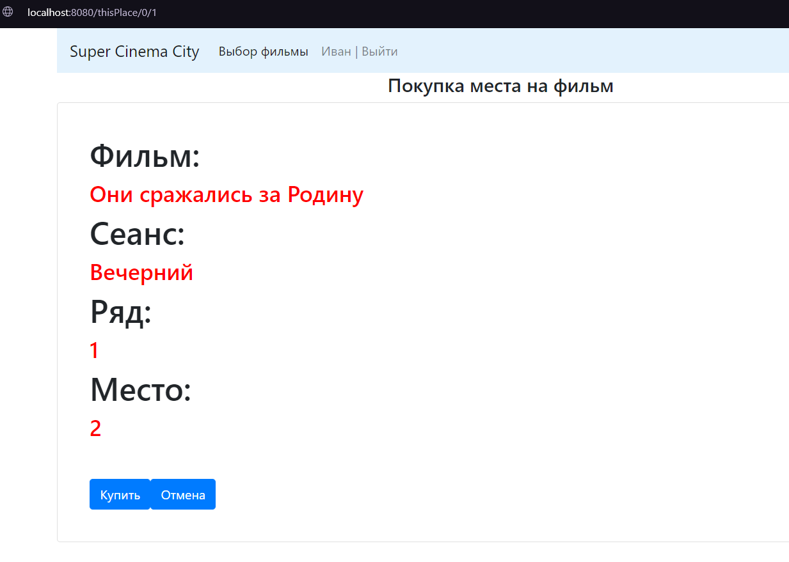

Билет куплен:
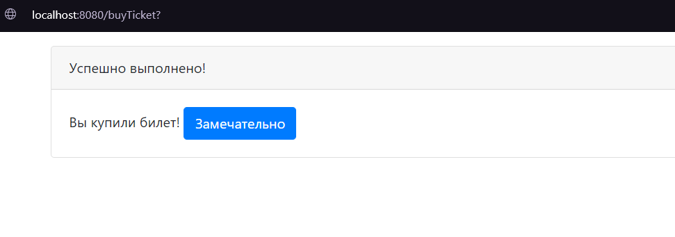

Регистрация на сайте:
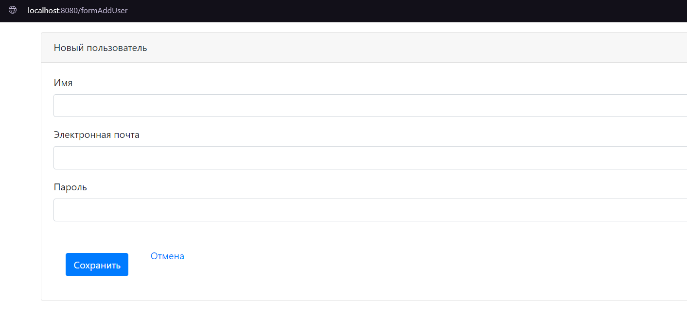

Ошибка повторной регистрации:
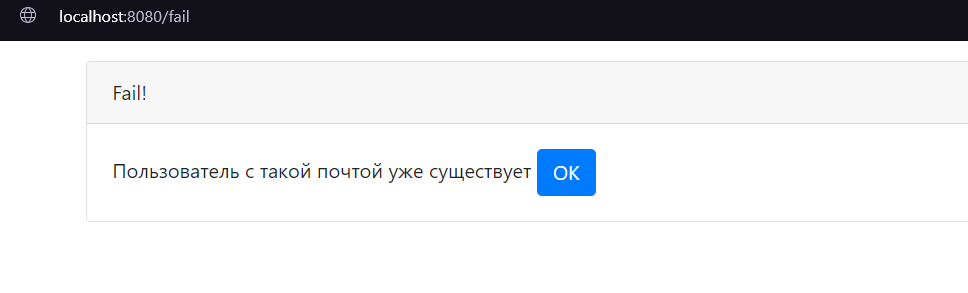

Меню под админом:
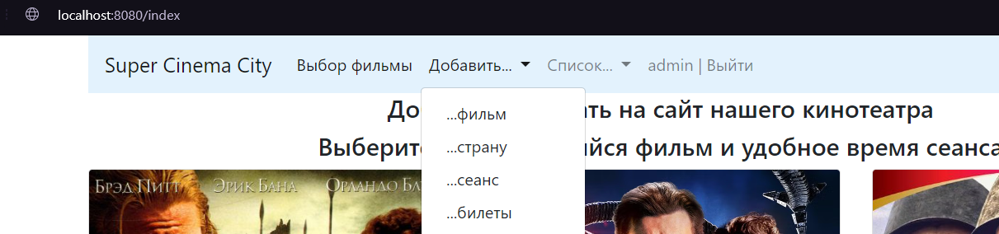

Заведение фильма под админом:
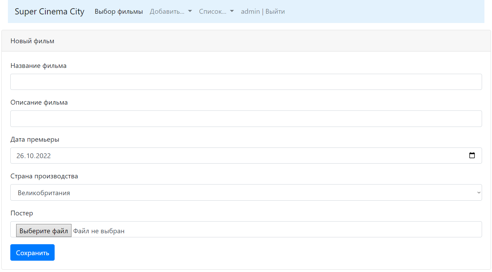

Просмотр списка заведенных фильмов с возможностью подредактировать (под админом):
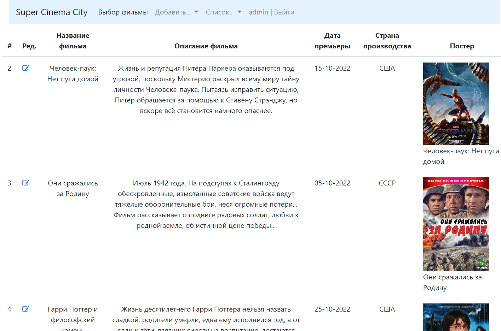

Если не успел купить билет и кто-то его уже выкупил:
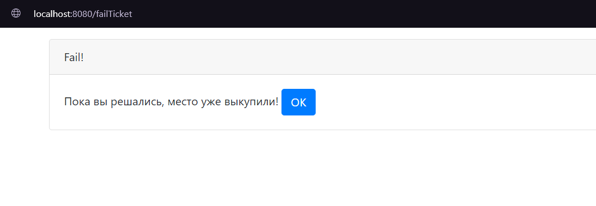


